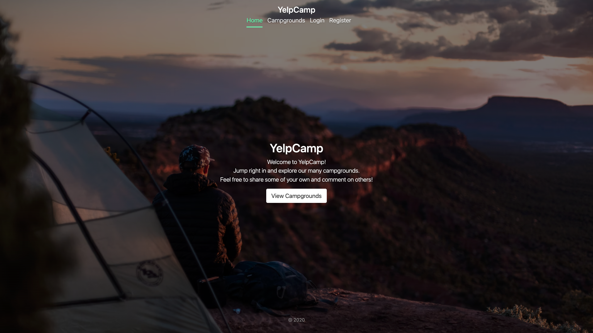

# 🏕️ YelpCamp 🏕️

YelpCamp is a web app where registered users can create and review campgrounds.

Check it out here: https://secret-plateau-48638.herokuapp.com/

## Tech Stack

- NodeJS, Express, MongoDB and Bootstrap 5.
- PassportJS to handle authentication.

## Features

- Visitors can view listed campgrounds (and their reviews, ratings etc.)
- Visitors can create an account.
- Registered users can create, read/view, update and delete their own campground reviews.
- Users can upload multiple images for each campground they submit.

### Homepage

- 
- 

### Campgrounds Index

- 
- 

### Register

- 

<em>Capstone project from Colt Steele's fullstack web dev course: https://www.udemy.com/course/the-web-developer-bootcamp/ <em>

