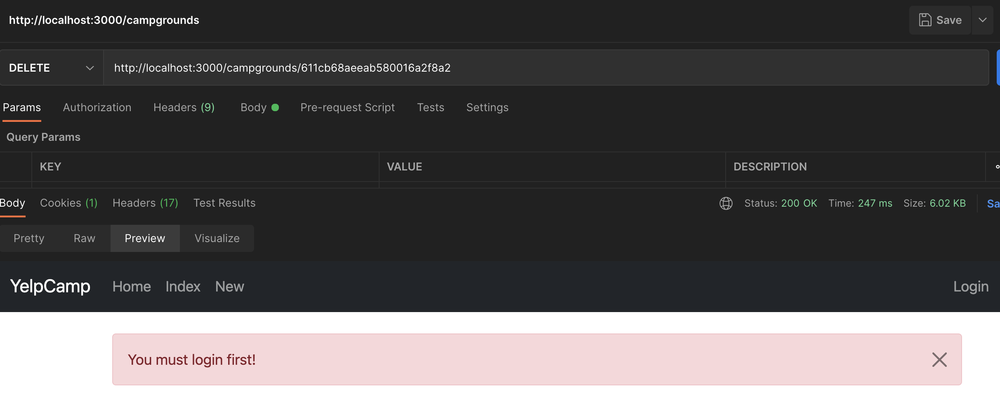

# 🏕️ YelpCamp 🏕️

YelpCamp is a web app where registered users can create and review campgrounds.

Check it out here: https://secret-plateau-48638.herokuapp.com/

## Tech Stack

- NodeJS, Express, MongoDB and Bootstrap 5.
- PassportJS to handle authentication.

## Features

- Visitors can view listed campgrounds (and their reviews, ratings etc.)
- Visitors can create an account.
- Registered users can create, read/view, update and delete their own campground reviews.
- Users can upload multiple images for each campground they submit.
- Error handling both on server-side and client-side implemented.

### Homepage

### Campgrounds Index

### Register User

### Submit New Campground

- Subsequently, users can only update/delete their own campgrounds and not others'.

### Review Campground + Star Rating

### Server-Side Error Handling

- Using postman to try to circumvent client-side error handling. Middleware check if the requests are valid and authorized (using JOI).

### Client-Side Error Handling

